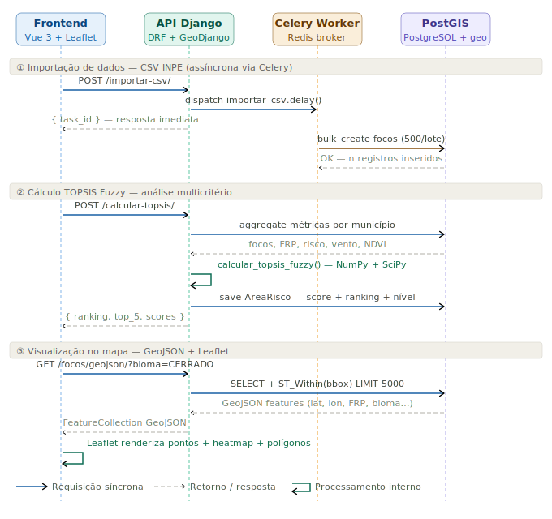
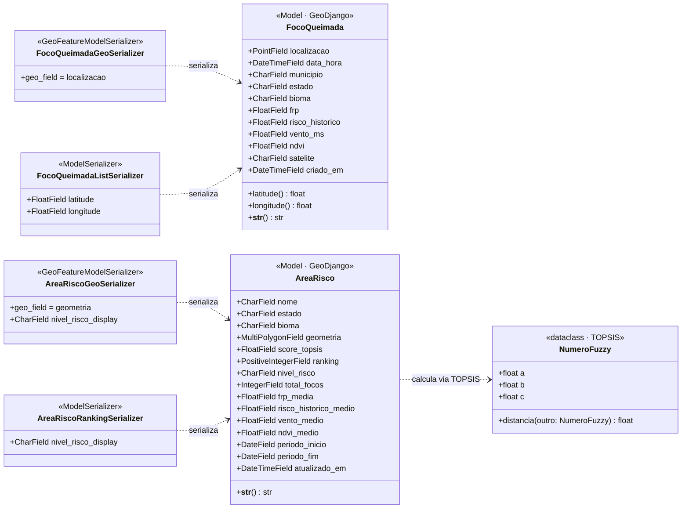

# 🔥 IgnisGeo — Plataforma Geoespacial de Risco de Queimadas

---

## Resumo

O **IgnisGeo** é uma plataforma web geoespacial de suporte à decisão para identificação e priorização de áreas de alto risco de queimadas no Brasil, com base em dados do **INPE (Instituto Nacional de Pesquisas Espaciais)**. A plataforma aplica a técnica de análise multicritério **TOPSIS Fuzzy** para ranquear municípios e regiões de acordo com múltiplos critérios ambientais e meteorológicos, gerando visualizações geoespaciais interativas que podem subsidiar políticas de prevenção e combate a incêndios florestais.

---

## Objetivo

Desenvolver uma plataforma de análise geoespacial que integre dados de focos de queimadas do INPE com métodos de decisão multicritério, permitindo:

- Importar e processar grandes volumes de dados de focos de queimadas
- Calcular scores de risco por meio do método **TOPSIS Fuzzy** com números fuzzy triangulares
- Visualizar áreas prioritárias em mapas interativos com heatmaps e polígonos de risco
- Oferecer uma interface web acessível para tomadores de decisão e pesquisadores

---

## Metodologia — TOPSIS Fuzzy

O método **TOPSIS** (*Technique for Order of Preference by Similarity to Ideal Solution*) com extensão fuzzy triangular (Chen, 2000) é utilizado para ordenar as alternativas (municípios) com base em cinco critérios:

| Critério | Peso Linguístico | Justificativa |
|---|---|---|
| Total de focos | Muito alto | Quantidade de ocorrências no período |
| FRP médio (MW) | Muito alto | Potência Radiativa do Fogo — intensidade |
| Risco histórico | Alto | Recorrência da área em séries históricas |
| Velocidade do vento | Médio | Capacidade de propagação do fogo |
| NDVI (vegetação) | Alto | Quantidade de biomassa disponível (critério invertido) |

O score final varia de **0 a 1**, classificado em quatro níveis de risco:

```
Score ≥ 0.75  →  Crítico
Score ≥ 0.55  →  Alto
Score ≥ 0.35  →  Médio
Score  < 0.35 →  Baixo
```

---

## Arquitetura do Sistema

### Visão de componentes — o que existe e como se conecta

Diagrama no estilo **C4 Container** mostrando os cinco containers internos do sistema, os dois atores externos e os relacionamentos entre eles.


### Visão de sequência — o que acontece e quando

Os três fluxos principais de comunicação em tempo de execução: importação assíncrona dos dados do INPE via Celery, execução do TOPSIS Fuzzy e visualização dos resultados em GeoJSON pelo Leaflet.



> Os dois diagramas são complementares: o de componentes documenta a **estrutura estática** do sistema; o de sequência documenta o **comportamento dinâmico** em cada fluxo de uso.

---

## Stack Tecnológica

| Camada | Tecnologia | Versão |
|---|---|---|
| Backend | Django + Django REST Framework | 5.0 / 3.15 |
| Análise geoespacial | GeoDjango + GeoPandas + Shapely | — |
| Análise multicritério | NumPy + SciPy (TOPSIS Fuzzy) | 2.0 / 1.13 |
| Banco de dados | PostgreSQL + PostGIS | 16 / 3.4 |
| Filas assíncronas | Celery + Redis | 5.4 / 7 |
| Frontend | Vue 3 + Pinia + Leaflet | 3.4 / 2.1 / 1.9 |
| Infraestrutura | Docker + Docker Compose | — |
| Fonte de dados | INPE BDQueimadas | — |

---

## Funcionalidades

- **Importação automática** de arquivos CSV do INPE via job assíncrono (Celery)
- **Processamento geoespacial** com índices espaciais PostGIS (`ST_Within`, `GIST`)
- **Análise multicritério TOPSIS Fuzzy** com números triangulares e pesos linguísticos
- **API RESTful** com endpoints GeoJSON para consumo no frontend
- **Mapa interativo** com três camadas: focos individuais, heatmap de intensidade e polígonos de risco
- **Filtros dinâmicos** por bioma, estado, período e nível de risco
- **Painel de ranking** com top 10 áreas prioritárias e score TOPSIS
- **Dashboard** com estatísticas gerais por bioma

---

## Endpoints da API

| Método | Rota | Descrição |
|---|---|---|
| `GET` | `/api/focos/geojson/` | GeoJSON dos focos (filtros por bioma, estado, bbox, data) |
| `GET` | `/api/areas-risco/geojson/` | GeoJSON dos polígonos ranqueados |
| `GET` | `/api/ranking/` | Ranking TOPSIS sem geometria |
| `GET` | `/api/estatisticas/` | Resumo para o dashboard |
| `POST` | `/api/calcular-topsis/` | Executa o algoritmo TOPSIS Fuzzy |
| `POST` | `/api/importar-csv/` | Importa CSV do INPE via Celery |

---

## Como executar

### Pré-requisitos

- Docker e Docker Compose instalados
- Arquivo CSV de focos do INPE (disponível em [BDQueimadas](https://queimadas.dgi.inpe.br/queimadas/bdqueimadas))

### Passo a passo

```bash
# 1. Clonar o repositório
git clone https://github.com/seu-usuario/ignisgeo.git
cd ignisgeo

# 2. Subir todos os serviços
docker-compose up --build

# 3. Criar as tabelas no banco
docker-compose exec backend python manage.py migrate

# 4. Criar superusuário (opcional)
docker-compose exec backend python manage.py createsuperuser

# 5. Colocar o CSV do INPE na pasta data/
cp focos_br_ref_2024.csv ./data/

# 6. Importar os dados
curl -X POST http://localhost:8000/api/importar-csv/ \
  -H "Content-Type: application/json" \
  -d '{"caminho": "/app/data/focos_br_ref_2024.csv"}'

# 7. Calcular o TOPSIS Fuzzy
curl -X POST http://localhost:8000/api/calcular-topsis/ \
  -H "Content-Type: application/json" \
  -d '{"data_inicio": "2024-01-01", "data_fim": "2024-01-31"}'
```

### Acesso

| Serviço | URL |
|---|---|
| Frontend | http://localhost:5173 |
| API Django | http://localhost:8000/api/ |
| Admin Django | http://localhost:8000/admin/ |

---

## Diagrama de Classes

Visão dos **models Django**, **serializers DRF** e da classe de domínio `NumeroFuzzy` do algoritmo TOPSIS Fuzzy, com seus atributos, métodos e relacionamentos.



> Para visualizar o diagrama localmente com mais detalhes, abra o arquivo [`diagrama-classes.html`](diagrama-classes.html) no navegador.

---

## Estrutura do Repositório

```
ignisgeo/
├── backend/
│   ├── config/                  # Settings, URLs, Celery
│   ├── queimadas/
│   │   ├── models.py            # FocoQueimada, AreaRisco (GeoDjango)
│   │   ├── views.py             # Endpoints REST + GeoJSON
│   │   ├── serializers.py       # GeoFeatureModelSerializer
│   │   ├── topsis_fuzzy.py      # Implementação TOPSIS Fuzzy (NumPy)
│   │   └── tasks.py             # Celery: importação CSV INPE
│   ├── requirements.txt
│   └── Dockerfile
├── frontend/
│   └── src/
│       ├── api/                 # Axios — chamadas ao backend
│       ├── components/          # MapaQueimadas, FiltrosPainel, PainelRanking
│       └── stores/              # Pinia store
├── data/                        # CSVs do INPE (não versionados)
├── diagrama-componentes-c4.svg  # Arquitetura estática (C4 Container)
├── diagrama-sequencia.svg       # Fluxos de sequência
├── diagrama-classes.html        # Diagrama de classes (abre no navegador)
├── docker-compose.yml
└── README.md
```

---

## Fonte de Dados

Os dados de focos de queimadas são obtidos do **BDQueimadas** do INPE:

> Instituto Nacional de Pesquisas Espaciais (INPE). *Banco de Dados de Queimadas*. Disponível em: https://queimadas.dgi.inpe.br/queimadas/bdqueimadas

Cada registro contém: latitude, longitude, data/hora (GMT), satélite, município, estado, bioma e FRP (Fire Radiative Power em MW).

---

## Referências

- CHEN, C.T. Extensions of the TOPSIS for group decision-making under fuzzy environment. **Fuzzy Sets and Systems**, v. 114, n. 1, p. 1–9, 2000.
- INPE. **Programa Queimadas**. Instituto Nacional de Pesquisas Espaciais, 2024.
- GOODCHILD, M.F. Geographic information science. **International Journal of Geographical Information Systems**, v. 6, n. 1, p. 31–45, 1992.
- POSTGIS. **PostGIS Documentation**. Disponível em: https://postgis.net/docs/
- DJANGO SOFTWARE FOUNDATION. **Django documentation**. Disponível em: https://docs.djangoproject.com/

---

## Licença

Este projeto foi desenvolvido como Trabalho de Conclusão de Curso e é disponibilizado para fins acadêmicos.  
Licença [MIT](LICENSE) — sinta-se livre para estudar, adaptar e referenciar com a devida citação.

---

> *"Ignis é fogo em latim — IgnisGeo nasceu da necessidade de enxergar onde o fogo vai antes que ele chegue."*
